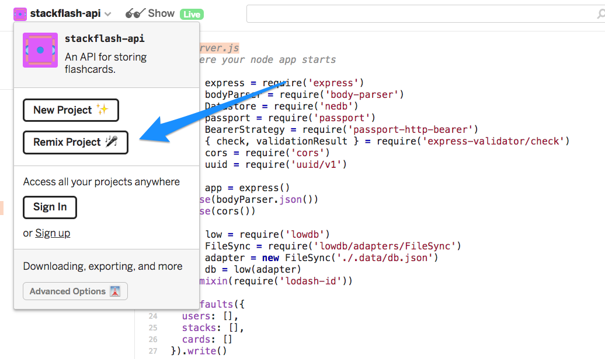

# Stackflash

[Click here for the `create-react-app` README.](README.cra.md)

## Setup for development

After cloning the repo, you need to install all dependencies by running:

```
yarn install
```

You then need to make a `.env` file. This file sets up environment variables used in configuration. A sample one is provided at `.env.sample`. You can copy that to `.env`.

## Running the app

To start the app, run:

```
yarn start
```

## Setting up your own instance of the API

If you want to use your own instance of the API for development -- a very good idea -- then you can!

1. Go to https://glitch.com/edit/#!/stackflash-api. Click the "Remix" button, as seen below:



2. Once you do that, click "Show" to open up a window with the URL of your new API instance.

3. Edit your `.env` file to have the URL of your API instance. It should look like this:

```
REACT_APP_API_DOMAIN=https://tall-bay.glitch.me/
```

You will need to restart your dev server if it is currently running.
